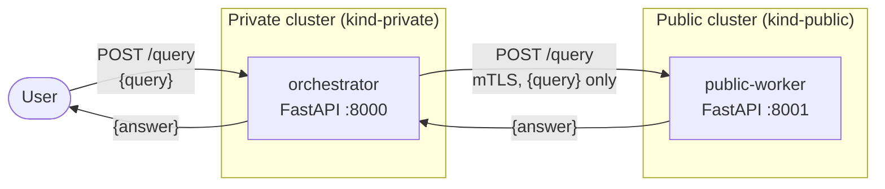

# Hybrid Cloud Agents

A proof-of-concept for a drag-and-drop **agent builder focused on
infrastructure** — a tool for composing what gets deployed on a **private
(on-prem)** cluster versus a **public (cloud)** cluster, while guaranteeing
that **private data never leaves the private cluster** (with exactly one
exception: the raw user query).

The project is built incrementally as a series of versioned prototypes. See
[`specs/index.md`](specs/index.md) for the long-term vision and the full
roadmap, and [`specs/v2-spec.md`](specs/v2-spec.md) for the current version.

## Status

**V2** — mTLS hardening on top of the V1 two-`kind`-cluster plumbing (still
no AI, no retrieval). The full prior prototype (LangGraph + Chroma + local
LLM) is preserved on the `archive/v1-original` branch and will be
reintroduced incrementally in later versions.

## Architecture (V1-V2)

Two independent `kind` clusters, one mutually-authenticated TLS call between
them. The orchestrator forwards only the raw query; the public worker returns
a canned answer.



The two clusters share a Docker network (`kind`) for connectivity but have no
cross-cluster DNS, so `make deploy` resolves the public node's address and
patches it into the orchestrator's `hostAliases` (see `Makefile`). Both
services authenticate each other via mutual TLS, using certs generated by
`make certs` and loaded into each cluster by `make load-certs` (see
[`specs/v2-spec.md`](specs/v2-spec.md)).

## Stack and why

- **uv (not conda)** — single tool for the venv, dependency resolution, and a
  lockfile (`uv.lock`); fast enough that recreating the environment from
  scratch is never a cost worth avoiding. Conda's main advantage is managing
  non-Python binary dependencies (CUDA, BLAS, compilers), which this project
  doesn't need — every dependency is pure Python, so a conda env plus a
  separate pip layer would just be more to keep in sync. See `DECISIONS.md`.
- **FastAPI + uvicorn** — minimal, typed HTTP framework for both services.
  Async-capable, but V1's handlers are plain `def` — there's no concurrent
  work yet to benefit from `async`.
- **httpx** — used for the orchestrator's one outbound call to the public
  worker. A single synchronous `httpx.post` is all it needs; an
  `ssl.SSLContext` (built from the CA + client cert/key) is passed as
  `verify=` for mTLS (see V2).
- **pydantic** — `PublicWorkerRequest`/`PublicWorkerResponse` in
  `src/common/models.py` define the wire contract once, shared by both
  services, so request/response shapes can't silently drift apart.
- **Two `kind` clusters (not k3s/k3d)** — `kind` runs each cluster node as a
  Docker container using stock upstream Kubernetes, the same way the
  Kubernetes project tests itself. Spinning up several independent clusters
  is a one-liner each, with no extra components to reason about. `k3s` is a
  lighter single-binary distro suited to one long-lived dev cluster, but it
  bundles its own defaults (Traefik, local-path storage) and running multiple
  isolated clusters needs `k3d` on top — more moving parts for the same
  result here. Both clusters join the same `kind` Docker network, so
  cross-cluster traffic is possible — but `kind` provides no cross-cluster
  DNS, hence the `hostAliases` patch in `make deploy`.
- **mTLS via a shared self-signed CA** — `certs/gen-certs.sh` generates a CA
  plus a client cert/key (orchestrator) and server cert/key (public worker);
  `make certs`/`make load-certs` generate and distribute them as Kubernetes
  Secrets. V1 isolated the *topology* and the *one-way membrane contract*
  from transport security; V2 adds mTLS as a self-contained, additive
  increment with no application-logic changes (see `DECISIONS.md`, "V1 drops
  mTLS").
- **Plain Kubernetes YAML manifests + Docker** — no Helm/Kustomize. Two small
  Deployment+Service pairs don't need templating yet.
- **ruff** — one tool for linting, formatting, import sorting, and docstring
  conventions (replaces flake8 + black + isort + pydocstyle).
- **GitHub Actions** — `lint-and-unit` and `boundary` jobs mirror `make test`.
  E2E is excluded from CI since it needs live `kind` clusters.

## Prerequisites

- Python 3.11+ and [uv](https://docs.astral.sh/uv/)
- [Docker](https://docs.docker.com/get-docker/)
- [kind](https://kind.sigs.k8s.io/docs/user/quick-start/#installation)
- [kubectl](https://kubernetes.io/docs/tasks/tools/)
- `openssl` — used by `certs/gen-certs.sh` to generate the mTLS CA and certs

## Running V1-V2

```console
$ uv sync                 # install dependencies
$ make test                # lint + unit + boundary + mTLS tests

$ make dev                  # spin up both kind clusters, build/load images, gen+load certs, deploy
$ make test-e2e             # query the deployed orchestrator end-to-end over mTLS
$ make clusters-down         # tear down both kind clusters when done
```

`make dev` also runs `make certs` (generate the CA + client/server certs)
and `make load-certs` (push them into each cluster as Secrets) before
deploying. `make test-e2e` sends a query to the orchestrator's NodePort
(private cluster) and asserts it gets back the public worker's canned
response over mTLS, proving the cross-cluster path works end to end.

## Testing

- **`tests/unit/`** — mirrors `src/`. Tests each FastAPI endpoint and the
  Pydantic models in isolation; the orchestrator's outbound call to the
  public worker is mocked.
- **`tests/integration/boundary/`** (`test_membrane.py`) — the **one-way
  membrane** test. Spins up the orchestrator against a fake public worker and
  asserts that exactly one outbound request is made and its body is *only*
  `{"query": "<the raw query>"}` — for a range of inputs (empty string,
  special characters, etc.). This is the contract that becomes
  safety-critical from V3 onward, once private data exists; V1 fixes its
  shape now. Run via `make test` and the CI `boundary` job.
- **`tests/integration/mtls/`** (`test_mtls.py`) — starts the public worker
  as a real uvicorn subprocess with mTLS enabled and asserts: a client with a
  cert signed by the trusted CA succeeds; a client with no cert is rejected;
  a client with a cert from an untrusted CA is rejected; and the
  orchestrator's `/query` endpoint completes a real mTLS round trip to the
  public worker (no mocked TLS). Run via `make test`.
- **`tests/integration/e2e/`** (`test_kind_clusters.py`) — marked
  `@pytest.mark.e2e` and excluded from the default test run
  (`addopts = "-m 'not e2e'"` in `pyproject.toml`). Run via `make test-e2e`
  after `make dev`. It looks up the private cluster's kind node IP, sends a
  real HTTP request to the orchestrator's NodePort, and asserts the response
  is the public worker's canned answer — proving the full topology (build →
  load → deploy → cross-cluster HTTP → response) works end to end, not just
  the application code in isolation.

## Documentation

API docs (mkdocstrings reference generated from source docstrings, per
`mkdocs.yml`) are built with [mkdocs](https://www.mkdocs.org/):

```console
$ uv run mkdocs serve   # live-reloading local preview at http://127.0.0.1:8000
$ uv run mkdocs build   # static site in site/ (gitignored)
```

## Decisions log

Significant project decisions and their rationale are recorded in
[`DECISIONS.md`](DECISIONS.md).

## License

Apache License 2.0 — see [LICENSE](LICENSE).
